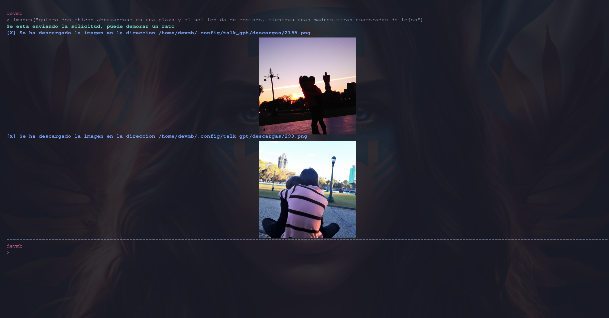

  
# TALK GPT 0.5v

- This is a simple Bash script that uses OpenAI's GPT-3 API to chat with an AI. The script allows you to create a new chat, or to continue a previous one. The responses are in text and can now also be generated with a robotic voice.
- ***v0.3*** The configuration and chat files are now by default saved in $HOME/.config/talk_gpt, allowing for separation of the script and files and making it possible to include them in the same system.

- ***v0.5*** Now it is possible to request images from the model and generate them simply by writing a prompt.


## Install

with the -config option, the first time is convenient for you to check the system

```bash
mkdir ~/talk_gpt/
cd ~/talk_gpt/
wget https://raw.githubusercontent.com/DevMBInformes/talk_gpt/main/talk_gpt.sh 
chmod +x talk_gpt.sh
./talk_gpt.sh -config
```

or

```bash
./talk_gpt.sh
```

## Requirements

To use this script, you need to have **curl**, **jq**, **bc**, **espeak-ng**, **wget** and **imagemagick** installed on your system. You also need to have an OpenAI API key to use the GPT-3 API.
Usage

To use the script, simply run the ./talk_gpt.sh command. You will be presented with a menu:

You should also generate an API KEY at https://platform.openai.com/account/api-keys and replace it in the variable YOUR_API_KEY.


1. Recuperar un chat 
2. Crear un nuevo chat
3. Configurar opciones
4. Configuraciones por defecto
5. Borrar todos los chats
6. Comprobar el sistema (BETA)
0. Salir

  *  Opción 1 Permite continuar una conversación anterior.
  *  Opción 2 Crea un nuevo chat
  *  Opción 3 Se pueden modificar las opciones, temperatura, modelo, ruta, url, si habla o no
  *  Opción 4 Borra las configuraciones y las lleva a por defecto.
  *  Opción 5 Borra todos los chats
  *  Opción 6 Comprueba que esten instaladas ciertas librerias y sino las instala automaticamente.
  *  Opción 0 Sale del script.


## Commands prompt:
---
> ayuda
---

~~~
A continuación se listan una serie de comandos que pueden ser incluidos en el prompt y que 
se reconoceran, casi todos deben estar solos, img() si si esta acompañada se separa pero el resto no
~~~
* **ver_img**

        devuelve las imagenes disponibles en el directorio definido para
        trabajar con imagenes.

* **img(valor1,valor2)**

        valor1: tiene que ser el número de imagen que se quiere trabajar que fue
        devuelto por ver_img, tomara esa imagen y la reducira y luego la convertira en base64
        valor2: es un string que ira acompañado de la imagen para pasarle como mensaje.

* **borrar_cache**

        borra el archivo chat* con el que se esta trabajando actualmente por si la conversación se volvio
        muy extensa, a veces es conveniente porque puede mezclar temas

* **volver**

        Vuelve al menú inicial cortando el flujo de la conversación, por lo tanto no se guarda.

* **chau**

        Sale directamente del programa, cortando el flujo de la conversación y devuelve el nombre del
        archivo chat* donde se estuvo guardando la conversación

* **ver_valores**

        Muestras los valores actuales con los que esta trabajando

* **m_voz**

        Permite modificar el valor de la variable voz, para que lea el contenido o no, es false o true

* **ayuda**

        Es donde vas a estar

* **imagen()**

        Se envia un prompt entre comillas dobles, esto descargara las imagenes si es una terminal kitty se mostraran
        en pantalla a tamaño reducido, si no se indicara la ruta, es importante que esten seteados los valores correctamente. 
        ver m_n y m_size
* **m_n**

        Este valor define la cantidad de imagenes que queremos generar.
        
**m_size**

        Esto definira los valores para el tamaño de las imagenes que solicitemos.

<details><summary> <b>Images ScreenShots (Click to expand!)</b></summary>




